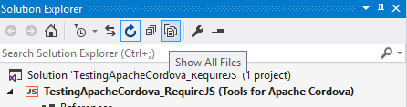
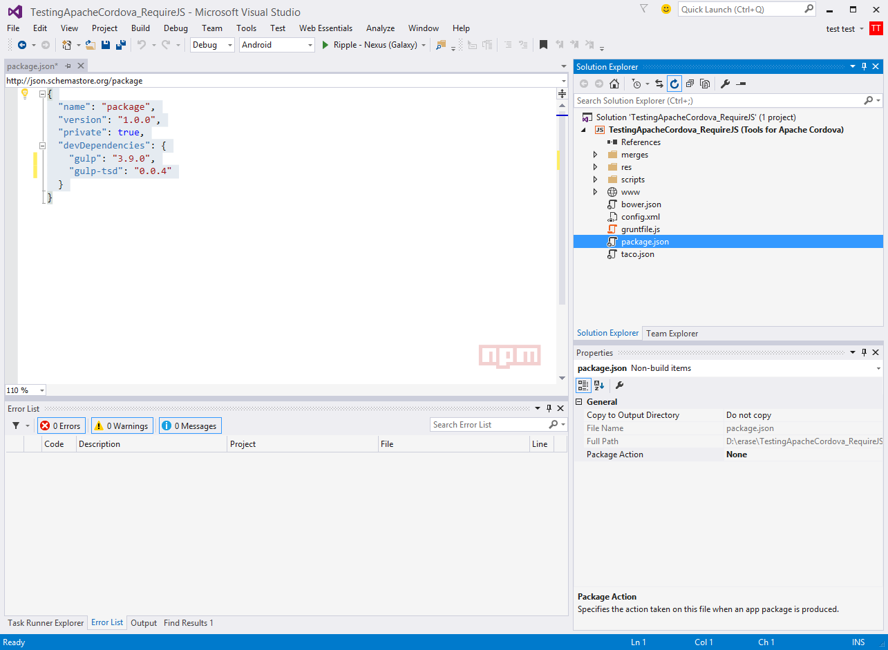
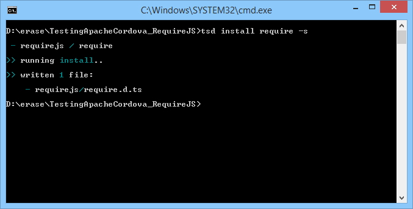
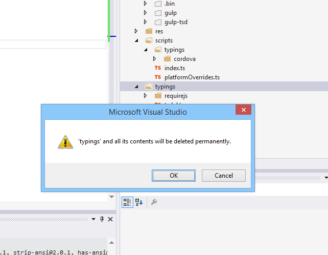
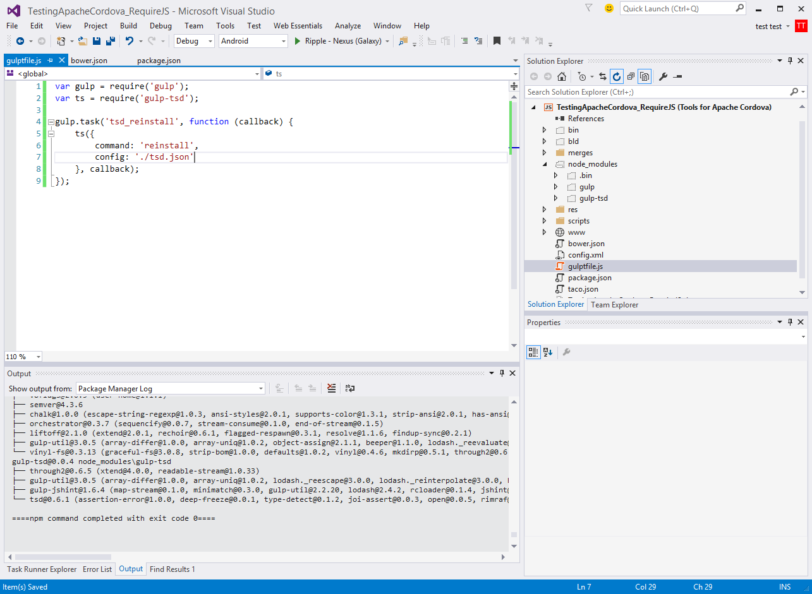
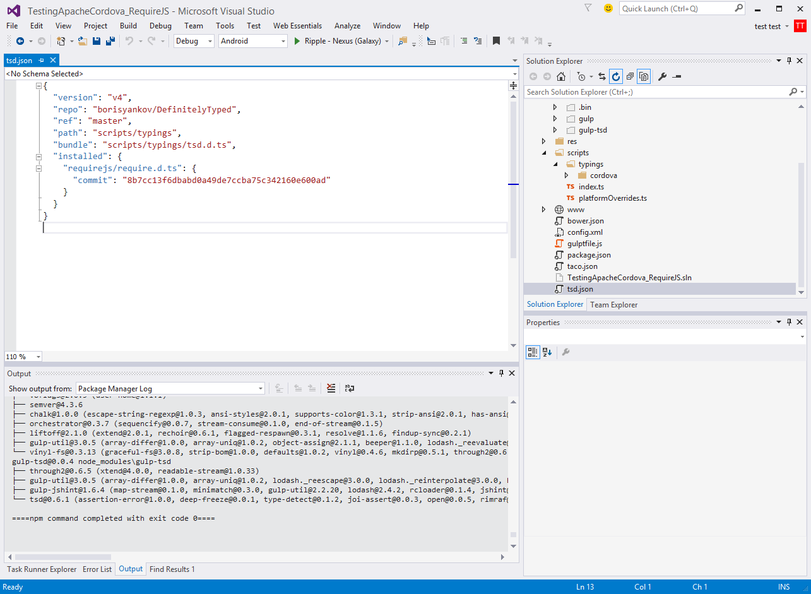
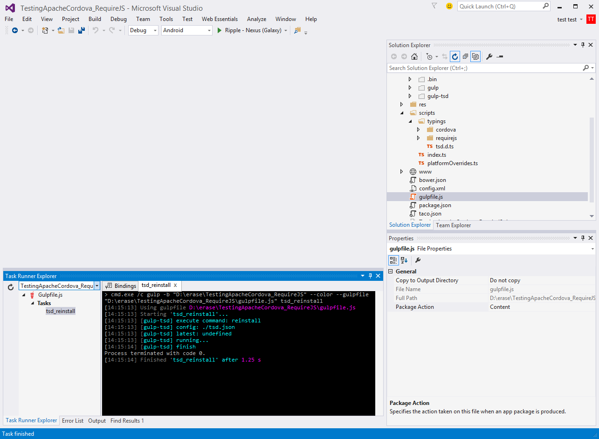
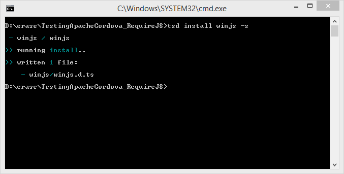

# Visual Studio Apache Cordova + TypeScript + RequireJS #

## Purpose: ##
Use the readme to provide a roadmap for starting projects with TypeScript and RequireJS.  The instructions apply only to VS 2015. This is just a starting point, if you encounter any problems, please contact me. 

@deanbiele
github.com/dbiele


## Getting Started: ##
###Creating a blank project###

Create a blank Apache Cordova Apps project by selecting File > New Project 
Installed > Templates > Other Languages > TypeScript > Apache Cordova Apps.
Save the project anywhere.

### Clean up the blank project. ###

#### Modify the config.xml to update Cordova CLI ####

Change the Cordova CLI to 5.0.0
In the Solution Explorer select config.xml
Select the Platforms button in the config.xml UI and change the Cordova CLI to 5.0.0.
Save and Close the config.xml file.

#### Delete the Project_Readme.html. ####
This file is not necessary.  Get rid of it. If you're not familiar with the information in the file, check it out.  However, after seeing it hundreds to times you'll  want to delete is as soon as possible.

#### Turn on "Show all Files" ####
In the solution explorer select the "Show all items" button near the top of the Solution Explorer.



## Adding Packages and Tasks ##

### Adding Package and Task Managers. ###

We'll use package and task managers to install requirejs, gulp, require.d.ts files.  I like gulp for as a task manager, but you can use Grunt instead.  The process of using Grunt is essentially the same.

### Adding package.json and bower.json. ###
In Solution Explorer, select any of the folders, right click > add Grunt and Bower to project.
You will now see the bower.json, gruntfile.js and package.json have been added to the solution explorer. 

### Modify package.json to add Gulp and Gulp-TSD ###

Gulp is our task runner.  Gulp-tsd allows us to download and place d.ts files into the projects scripts folder.

Open the package.json. 
Remove the grunt reference
`"grunt": "0.4.5"`.
Add a reference to Gulp and Gulp-TSD. 

``` {
	"name": "package",
	"version": "1.0.0",
	"private": true,
	"devDependencies": {
    "gulp": "3.9.0",
    "gulp-tsd": "0.0.4"
	}
} ```

Save the package.json file.  When the file is saved, VS will automatically download the gulp and gulp-tsd into the node-modules folder.



### Delete Grunt. Add Gulp ###

Delete the gruntfile.js in the solution explorer and add  a gulpfile.js.  Add gulpfile.js to the top level of the project.  You can right click > add > new item > gulpfile.js.  Or, download "Add New File" Extensions and Updates and press Shift + F2 and make you life easier!

###Add TSD ###
TSD is a package manager to search and install TypeScript definition files directly from the community driven DefinitelyTyped repository. 
[https://github.com/Definitelytyped/tsd](https://github.com/Definitelytyped/tsd)

Open a Command Prompt. It's best to use VS's "Open Command Line" extension. Install it in VS by using Tools > Extensions and updates.

Type ```npm install tsd -g``` into the command prompt to install TSD globally.  This only needs to be done once.

###Install requirejs.d.ts in project### 
In the command prompt, type ```tsd install require -s```. This will download the require.d.ts file and save it to tsd.json.


You can download any definatelytyped definitition by using the same syntax and simply changing the name.  example ```tsd install winjs -s```

## Making TSD work for VS 2015 Cordova folder structure ##
When TSD downloads the d.ts files it creates a folder at the root level called `typings`. The Cordova folder structure does not support this.  Typings are saved in the scripts folder.  Therefore, we need to change where TSD save the files.

###Updating TSD typings folder###
You'll notice a typings folder in the root level of our project.  Delete it.  We'll use TSD and Gulp to reinstall them in the correct folder.

A tsd.json was created by TSD.  Do not delete it. We'll use it with gulp to reinstall the d.ts files.

### Create TSD task in Gulp ###

The gulp-tsd task will manage the download and reinstall of d.ts file.  

Here's the code to allow gulp-tsd to install d.ts files. "tsd_reinstall" is a name I gave the task, and you can change it to any name you like.  Note. Do not use spaces. The Task Runner Explorer will report errors.  

    var gulp = require('gulp');
    var ts = require('gulp-tsd');
    
    gulp.task('tsd_reinstall', function (callback) {
    ts({
    command: 'reinstall',
    config: './tsd.json'
    }, callback);
    });


Gulp-tsd will read a tsd.json and load the d.ts files into the project.

###Change the tsd.json###
tsd.json needs to be updated to change where to d.ts files are saved. 

Open tsd.json and change the path to point to the project roots script folder.
old: 
```  "path": "typings",
  "bundle": "typings/tsd.d.ts",
```
updated:
```
  "path": "scripts/typings",
  "bundle": "scripts/typings/tsd.d.ts",
```

Now save and close the file. Once the paths are changed we won't need to modify the files again.

###Reinstall the d.ts files using Gulp###
Now run the tsd task in the Task Runner Explorer (View > Other Windows > Task Runner Explorer).  Running the task will download and place the files into scripts/typings.


###Installing new d.ts files###
Now that TSD is pointing to `scripts/typings` you can install new d.ts using the command prompt.  Example `tsd install winjs -s`


##RequireJS and Cordova##
###Adding require.JS to index###

If you followed the previous steps, you now have RequireJS 


