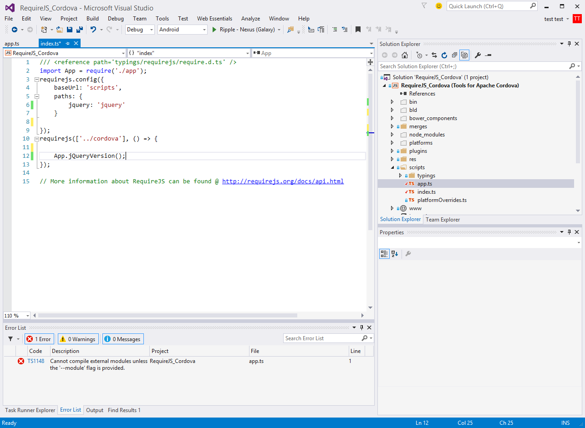

# Visual Studio Apache Cordova + TypeScript + RequireJS #

## Purpose: ##
Use this README.md and code to provide a road map for starting projects with Visual Studio 2015, TypeScript, Apache Cordova and RequireJS.  The instructions apply only to VS 2015. This is just a starting point. 

The source code for this demo is located in the `RequireJS_Cordova` folder. Use Visual Studio 2015 to open `RequireJS_Cordova.sln`.
Note. Please download TypeScript 1.5 before publishing.

If you encounter any problems, have any suggestions, etc. please contact me. 

**@deanbiele**

**github.com/dbiele**

[Questions? Issues? Problems? Use this GitHub link.](https://github.com/dbiele/Cordova_TypeScript_RequireJS_/issues)


Extensions for VS 2015.
-----
Use VS 2015 Tools > Extensions and Updates to download and install the extensions automatically in VS.  Otherwise, click the links to install manually. 

**Web Essentials** 
> [Download Link](https://visualstudiogallery.msdn.microsoft.com/ee6e6d8c-c837-41fb-886a-6b50ae2d06a2?SRC=VSIDE)

**Open Command Line** 
> [Download Link](https://visualstudiogallery.msdn.microsoft.com/4e84e2cf-2d6b-472a-b1e2-b84932511379?SRC=VSIDE)

**Add New File** 
>[Download Link](https://visualstudiogallery.msdn.microsoft.com/3f820e99-6c0d-41db-aa74-a18d9623b1f3?SRC=VSIDE)

### Manually download the following
---

**Update TypeScript to 1.5**
Download TypeScript 1.5 for Visual Studio.
> [https://visualstudiogallery.msdn.microsoft.com/3e5ba71c-abea-4d00-b81b-a62de3ad3d53](https://visualstudiogallery.msdn.microsoft.com/3e5ba71c-abea-4d00-b81b-a62de3ad3d53)

**Git Client**
You'll need a git client for some of the NPM packages. Here are a few.

> TortoiseGit: [http://code.google.com/p/tortoisegit/](http://code.google.com/p/tortoisegit/)

> SourceTree: [https://www.atlassian.com/software/sourcetree/overview](https://www.atlassian.com/software/sourcetree/overview)

> VS GitHub Extension: [https://visualstudio.github.com/](https://visualstudio.github.com/)

## Getting Started: ##
Here's what' covered.
> **Basic Steps**

>1. Creating a clean VS Apache Cordova project
2. Add Package Manager and Task Runner
3. Create a Task
3. Download d.ts files with TSD
4. Download & Install front end JavaScript with Bower
5. Setup RequireJS to load JavaScript files
6. Create TypeScript code 
7. Test loading jQuery with Require.JS 


###Creating a blank project###
Before getting into the code, our first step is to create a Apache Cordova VS project.

Create a blank Apache Cordova Apps project by selecting File > New Project 
Installed > Templates > Other Languages > TypeScript > Apache Cordova Apps.
Save the project.

### Clean up the blank project. ###
Let's make sure Cordova is up to date, delete any unnecessary files, and show all files.

#### Modify the config.xml to update Cordova CLI ####

Change the Cordova CLI to 5.0.0.

In the Solution Explorer select config.xml.
Select the Platforms button in the config.xml UI and change the Cordova CLI to 5.0.0.
Save and Close the config.xml file.

#### Delete the Project_Readme.html. ####
This file is not necessary.  Get rid of it. If you're not familiar with the information in the file, check it out.  However, after seeing it hundreds to times you'll  want to delete is as soon as possible.

#### Turn on "Show all Files" ####
In the solution explorer select the "Show all items" button near the top of the Solution Explorer.


## Add a Package Manager and Task Runner ##

We'll use NPM as our package manager and Gulp as our task runner. These tools allow us to download and install code while making it easy to update code we share. We'll use these tools to download requirejs, gulp, jQuery and d.ts files.

I like gulp for as a task manager, but you can use Grunt instead.  The process of using Grunt is essentially the same.

### Adding package.json and bower.json to the project###
Package.json manages NPM JavaScript packages like gulp and gulp-tsd.

Bower.json keeps track of front end javascript files like jQuery and Require.

In this example, we'll want package.json to download gulp and gulp-tsd. Adding the files is easy:

In Solution Explorer, select any of the folders, right click > add Grunt and Bower to project.

In the solutions explorer, you will see the newly created bower.json, gruntfile.js and package.json. 

### Modify package.json to add Gulp and Gulp-TSD ###

We'll use Gulp is our task runner.  But before we create Gulp tasks we'll need to install gulp. We'll modify package.json to download and install out Gulp files.  In addition, we'll add Gulp-TSD to manage out d.ts files.

Open the package.json. 
Remove the grunt reference in the devDependencies element.
`"grunt": "0.4.5"`.
Add a reference to Gulp and Gulp-TSD. 

``` {
	"name": "package",
	"version": "1.0.0",
	"private": true,
	"devDependencies": {
    "gulp": "3.9.0",
    "gulp-tsd": "0.0.4"
	}
} ```

Save the package.json file.  


Note. When the package.json file is saved, VS will automatically download the devDependencies into the `node-modules` folder.

### Add Gulp.js to Project ###

We're not using Grunt, delete the gruntfile.js in the solution explorer.  We'll use Gulp. 

Add a gulpfile.js to the root level of the project.  You can right click > add > new item > type the name "gulpfile.js".  A better option is to use the "Add New File" VS extension.  Wownload "Add New File" using Tools > Extensions and Updates.  Now use Shift + F2 to add new files. 

Note. Only one gulpfile is needed for a project.

###Adding TSD to Project ###
TSD is a package manager to download and install TypeScript definition files (d.ts) directly from the community driven DefinitelyTyped repository. 
[https://github.com/Definitelytyped/tsd](https://github.com/Definitelytyped/tsd)

TSD automatically downloads and place the files in the projects `typings` folder. It makes project maintenance easier.

We'll use the Command Prompt to install the TSD program and d.ts files. I try to avoid using the Command Prompt, but in this case I couldn't find a VS alternative.

Open a Command Prompt. In the Solutions Explorer, select Solution > Right click > Open Command Line.

Note: It's best to use VS's "Open Command Line" extension. "Open Command Line" is VS specific. Use Tools > Extensions and updates to download and install. Right Click > Open Command Line. 

Type ```npm install tsd -g``` into the command prompt to install TSD globally.  

Note. Once TSD is installed globally, there is no need to re-install for each project.

###Install requirejs.d.ts in project### 
Now that TSD is installed, we'll need TSD to download the require.js d.ts file. 

In the command prompt, type ```tsd install require -s```. This will download the require.d.ts file and save it to tsd.json.


###download jquery###
For this demo, we'll use require.js to load jQuery.  Download the jQuery d.ts file by opening a command prompt and enter the following:
```tsd install jQuery -s```

Note. You can download any definatelytyped d.ts files by using the same syntax and simply changing the name.  example ```tsd install winjs -s```


## Making TSD work for VS 2015 Cordova folder structure ##
When TSD downloads and installs the d.ts files, by default it creates a folder at the root level called `typings`. The default Apache Cordova folder structure does not support this.  Typings are saved in the project root's `scripts` folder.  Therefore, we need to change where TSD save the files. Copying and pasting is one solution, but it's not ideal.

###Updating TSD typings folder location###
After installing requireJS, you'll notice a typings folder and a tsd.json in the root level of our project.  Delete the `typings` folder.  We'll use Gulp and gulp-tsd to re-install the d.ts files into the correct folder (scripts/typings).

Do not delete the tsd.json. Gulp-tsd will use this file to reinstall the d.ts files.

### Create TSD task in Gulp ###

We now need to create a gulp-tsd task to manage the download and re-install of d.ts file. 

The following code uses gulp-tsd to install d.ts files. 
```
var gulp = require('gulp');
var ts = require('gulp-tsd');

gulp.task('tsd_reinstall', function (callback) {
ts({
command: 'reinstall',
config: './tsd.json'
}, callback);
});
```
You can find more information @ [https://github.com/moznion/gulp-tsd](https://github.com/moznion/gulp-tsd)


Note. "tsd_reinstall" is a name I gave the task. Change it to any name you like.  Do not use spaces. The Task Runner Explorer will report errors when a space is used in the name.  


The purpose of Gulp-tsd is to read a tsd.json and load the d.ts files into the projects scripts/typings folder.

###Change the tsd.json###
We'll need to update tsd.json to have TSD save the d.ts in the 'scripts/typings' folder. 

Open tsd.json and change the path to point to the project roots script folder.
old: 
```
  "path": "scripts/typings",
  "bundle": "scripts/typings/tsd.d.ts",
```

Save and close the file. 

Note. Once the paths are changed, no changed need to be made to tsd.json.  All updates will be done through the command prompt and TSD.

###Reinstall the d.ts files using Gulp###
Now run the tsd task in the Task Runner Explorer (View > Other Windows > Task Runner Explorer).  Running the tsd task will download and place the files into scripts/typings. This is alot of work just to download d.ts files, but when sharing projects it's important! You can also use `tsd reinstall -so` to reinstall the d.ts files.


###Installing new d.ts files###
When new d.ts files are needed for a project, use the command prompt to download and install. Example `tsd install winjs -s`


##Use Bower##
We'll now use Bower to download the require.js and jquery.js javascript files. Bower.io has more information on how to use: [http://bower.io/](http://bower.io/) 

Open bower.json and add the following to the dependencies element.
```
    "requirejs": "2.1.18",
    "jquery": "2.1.4"
```

Note. When you type the name of the package, VS will automatically search for the latest version number.

Saving the file will trigger Bower to download the files. When the download is complete, you'll see the new `bower_components` folder in the root of the project.   

###Copying Bower .js files to www###
Locate require.js and jquery.js in the bower_components folder. 
Copy and paste the files into the www/scripts folder.  We'll use HTML and Typescript to load these files.

##RequireJS and Cordova##
###Adding require.JS to index.html###
Up till now we've modified the project, downloaded front end JavaScript and d.ts files. Now let's write some code.

Open index.html in the `www` folder.
Remove the following code. 
```
    <!-- Cordova reference, this is added to your app when it's built. -->
    <script src="cordova.js"></script>
    <script src="scripts/appBundle.js"></script>
```
The idea is: We'll use require.js to load index.js.  Index.js will be used to load cordova.js, jQuery or any other JavaScript file. To get started, add the following code.
```
<script data-main="scripts/index" src="scripts/require.js"></script>
```

Note. `data-main` is the location of the first module that requireJS will load. Require always assumes it's loading .js files so there's no need to include .js in the file name.


##Using TypeScript to write JavaScript for require.js##
We'll use TypeScript to: 

- Configure requireJS
- Write custom code
- Load 3rd party JavaScript. 


##Editing index.ts##
We'll edit index.ts to have requireJS load JavaScript. 

Delete the current code and add the following:
```
/// <reference path='typings/requirejs/require.d.ts' />
requirejs(['../cordova'], () => {

});
```

The requirejs function will execute when all the dependencies have been loaded.  Once loaded, we can call classes, interfaces, modules, functions, or enums.

In this example, we'll create an external module called "app".  The purpose of "app" is it to test if jQuery loads and provides a version number.  

RequireJS helps by loading the jQuery framework and letting us reference it in our external modules. Therefore, we need to add the require.config code to index.ts. This will load the jquery.js file and we can call it using smaller strings for scripts.

```/// <reference path='typings/requirejs/require.d.ts' />
requirejs.config({
    baseUrl: 'scripts',
    paths: {
        jquery: 'jquery'
    }
});
requirejs(['../cordova'], () => {

});```

###Creating app external module and test jquery###
Create a new app.ts.
Add the following code.

```
import jq = require('jquery');
module App {
    "use strict";

    export function jQueryVersion() {
        console.log("jQueryVersion Called. jQuery Version = " + jq.fn.jquery);

    }
}
export = App;
```

Note. If you get a red highlight under import jq = require('jquery'); with the following error:

```
Cannot compile external modules unless the '--module' flag is provided.
```
Here's a solution. [http://stackoverflow.com/questions/29282269/using-external-modules-in-visual-studio-2015-ctp6-typescript-1-4](http://stackoverflow.com/questions/29282269/using-external-modules-in-visual-studio-2015-ctp6-typescript-1-4)


The code simply tests to see if we can reference the jQuery name from the code loaded by require.js.  You'll now see the intellisense appear when using the variable jq.

Now that we've created an external model, add the app to index.ts and have it call jQueryVersion().

###Add app.ts to index.ts###
Import the app module into index.ts and call initialize.  
```/// <reference path='typings/requirejs/require.d.ts' />
import App = require('./app');
requirejs.config({
    baseUrl: 'scripts',
    paths: {
        jquery: 'jquery'
    }
});
requirejs(['../cordova'], () => {
	App.jQueryVersion();
});```

###Add tsdconfig.json###

Unfortunately, by default VS2015 won't compile the typescript when we add require.js. We'll need to change the way VS2015 compiles Typescript.

Add a new file to the project root and label it tsconfig.json (SHIFT + F2).
Add the following code.
```
{
  "compilerOptions": {
    "emitDecoratorMetadata": true,
    "module": "amd",
    "target": "es5",
    "removeComments": true,
    "outDir": "./www/scripts/",
    "sourceMap": true
  },
  "files": [
    "./scripts/index.ts",
    "./scripts/typings/tsd.d.ts"
  ]
}
```


###Testing on Ripple###
Now let's test using Ripple.

Select Debug > Android > Ripple - Nexus (Galaxy).  

You will now see the console.log text from app.ts in the output window. 


