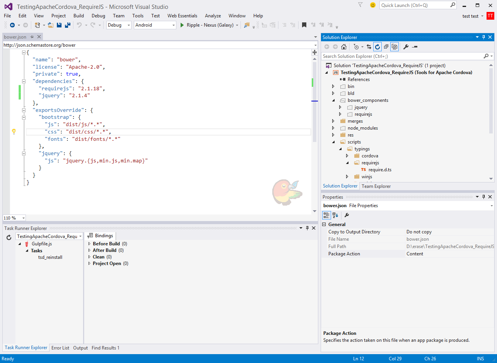
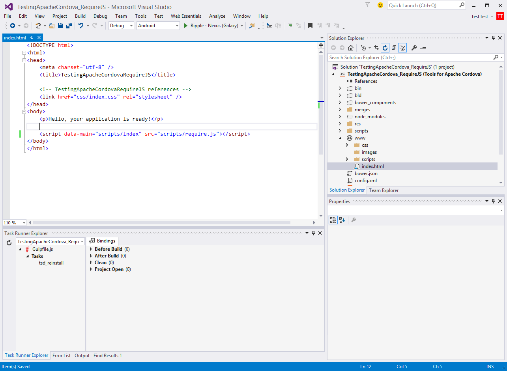

# Visual Studio Apache Cordova + TypeScript + RequireJS #

## Purpose: ##
Use the readme to provide a roadmap for starting projects with TypeScript and RequireJS.  The instructions apply only to VS 2015. This is just a starting point, if you encounter any problems, please contact me. 

@deanbiele
github.com/dbiele


## Getting Started: ##
###Creating a blank project###

Create a blank Apache Cordova Apps project by selecting File > New Project 
Installed > Templates > Other Languages > TypeScript > Apache Cordova Apps.
Save the project.

### Clean up the blank project. ###
Let's make sure Cordova is up to date, delete any unnessary files, and show all files.

#### Modify the config.xml to update Cordova CLI ####

Change the Cordova CLI to 5.0.0
In the Solution Explorer select config.xml
Select the Platforms button in the config.xml UI and change the Cordova CLI to 5.0.0.
Save and Close the config.xml file.

#### Delete the Project_Readme.html. ####
This file is not necessary.  Get rid of it. If you're not familiar with the information in the file, check it out.  However, after seeing it hundreds to times you'll  want to delete is as soon as possible.

#### Turn on "Show all Files" ####
In the solution explorer select the "Show all items" button near the top of the Solution Explorer.


## Add a Package Manager and Task Runner  

We'll use NPM as our package manager and Gulp as our task runner. The tools install requirejs, gulp, and require.d.ts files.  

I like gulp for as a task manager, but you can use Grunt instead.  The process of using Grunt is essentially the same.

### Adding package.json and bower.json to the project###
Package.json manages node modules like gulp and gulp-tsd.

Bower.json keeps track of front end javascript files like jQuery and Require.

In this example, we'll want package.json to download gulp and gulp-tsd. Adding the files is easy:

In Solution Explorer, select any of the folders, right click > add Grunt and Bower to project.
You will now see the bower.json, gruntfile.js and package.json have been added to the solution explorer. 

### Modify package.json to add Gulp and Gulp-TSD ###

We'll use Gulp is our task runner.  To install gulp, we'll need to modify the package.json.  In addition, we'll add Gulp-TSD to manage out d.ts files.

Open the package.json. 
Remove the grunt reference
`"grunt": "0.4.5"`.
Add a reference to Gulp and Gulp-TSD. 

``` {
	"name": "package",
	"version": "1.0.0",
	"private": true,
	"devDependencies": {
    "gulp": "3.9.0",
    "gulp-tsd": "0.0.4"
	}
} ```

Save the package.json file.  When the file is saved, VS will automatically download the gulp and gulp-tsd into the node-modules folder.


### Delete Grunt. Add Gulp ###

We're not using Grunt, delete the gruntfile.js in the solution explorer.  We'll use Gulp instead of Grunt. Add a gulpfile.js to the top level of the project.  You can right click > add > new item > gulpfile.js.  Or, download "Add New File" Extensions and Updates and press Shift + F2 and make you life easier! We only need one gulpfile for the project.

###Add TSD ###
TSD is a package manager to search and install TypeScript definition files directly from the community driven DefinitelyTyped repository. 
[https://github.com/Definitelytyped/tsd](https://github.com/Definitelytyped/tsd)

TSD automatically downloads and place the files in the typings folder. It makes project maintenance easier.

Open a Command Prompt. 

Note: It's best to use VS's "Open Command Line" extension. "Open Command Line" is VS specific, so use Tools > Extensions and updates to download and install.

Type ```npm install tsd -g``` into the command prompt to install TSD globally.  

Note. Once TSD is installed globally, there is no need to re-install for each project.

###Install requirejs.d.ts in project### 
In the command prompt, type ```tsd install require -s```. This will download the require.d.ts file and save it to tsd.json.


###download jquery###
For this demo, we'll use require.js to load jQuery.  Download jQuery by opening a command prompt and enter the following:
```tsd install jQuery -s```

Note. You can download any definatelytyped d.ts files by using the same syntax and simply changing the name.  example ```tsd install winjs -s```


## Making TSD work for VS 2015 Cordova folder structure ##
When TSD downloads and installs the d.ts files, by default it creates a folder at the root level called `typings`. The Cordova folder structure does not support this.  Typings are saved in the project roots scripts folder.  Therefore, we need to change where TSD save the files.

###Updating TSD typings folder###
After installing requireJS, you'll notice a typings folder and a tsd.json in the root level of our project.  Delete the `typings` folder.  We'll use Gulp and gulp-tsd to re-install them in the correct folder.

Do not delete the tsd.json. We'll gulp to reinstall the d.ts files.

### Create TSD task in Gulp ###

We now need to create a gulp-tsd task to manage the download and re-install of d.ts file. 

Here's the code to allow gulp-tsd to install d.ts files. 
```
var gulp = require('gulp');
var ts = require('gulp-tsd');

gulp.task('tsd_reinstall', function (callback) {
ts({
command: 'reinstall',
config: './tsd.json'
}, callback);
});
```

Note. "tsd_reinstall" is a name I gave the task. Change it to any name you like.  Do not use spaces. The Task Runner Explorer will report errors when a space is in the name.  


The purpose of Gulp-tsd is to read a tsd.json and load the d.ts files into the projects scripts/typings folder.

###Change the tsd.json###
To make sure TSD save the files into the scripts/typings folder, tsd.json needs to be updated. 

Open tsd.json and change the path to point to the project roots script folder.
old: 
```
  "path": "scripts/typings",
  "bundle": "scripts/typings/tsd.d.ts",
```

Save and close the file. 

Note.Once the paths are changed we won't need to modify the tsd.json again.  All updates will be done through the command prompt.

###Reinstall the d.ts files using Gulp###
Now run the tsd task in the Task Runner Explorer (View > Other Windows > Task Runner Explorer).  Running the tsd task will download and place the files into scripts/typings.


###Installing new d.ts files###
When new d.ts files are need to be added to the project, use the command prompt to download and install. Example `tsd install winjs -s`


##Use Bower##
We'll now use Bower to download the require and jQuery javascript files. 

Open bower.json and add the following to the dependencies element.
```
    "requirejs": "2.1.18",
    "jquery": "2.1.4"
```

Note. When you type the name of the package, VS will automatically search for the latest version number.

Saving the file will cause Bower to download the files. When the download is complete, you'll see the new `bower_components` folder in the root of the project.   

###Copying Bower .js files to www###
Locate require.js and jquery.js in the bower_components folder. 
Copy and paste the files into the www/scripts folder.  We'll use HTML and Typescript to load these files.

##RequireJS and Cordova##
###Adding require.JS to index###

Open index.html in the `www` folder.
Remove the following code.  We'll use require.js to load index which will then load cordova.js.
```
    <!-- Cordova reference, this is added to your app when it's built. -->
    <script src="cordova.js"></script>
    <script src="scripts/appBundle.js"></script>
```
add
```
<script data-main="scripts/index" src="scripts/require.js"></script>
```

`data-main` is the location of the first module that require load.

require always assumes it's loading .js files so there's no need to include .js in the file name.



##Editing index.ts##

```
/// <reference path='typings/requirejs/require.d.ts' />
import App = require('./app');
requirejs.config({
    baseUrl: 'scripts',
    paths: {
        jquery: 'jquery'
    }
});
require(['../cordova'], () => {
    App.initialize();
});
```

